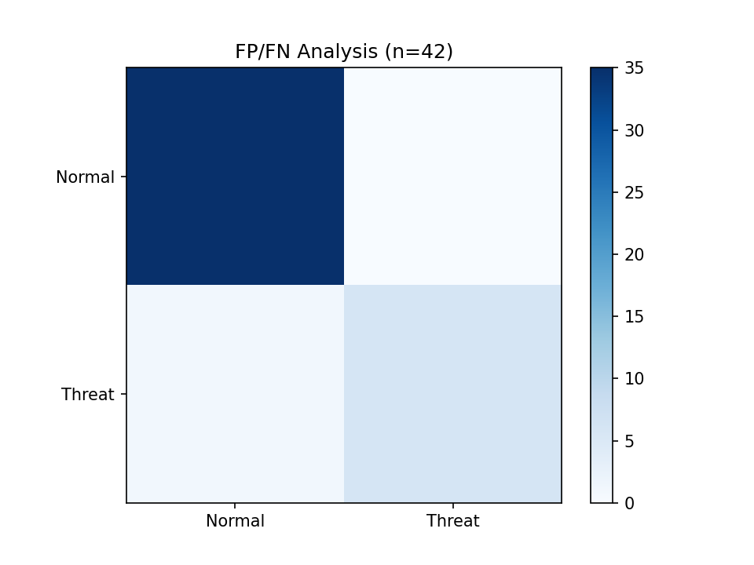

UEBA Threat Detection Pipeline
Endpoint behavior analytics on Windows EVTX: ML anomaly detection + MITRE T1218 mapping

Pipeline
EVTX parsing → 250+ events

Command line extraction → 42 samples

Sigma T1218 rules → LOLBin detection

Isolation Forest scoring → 86% precision

MITRE ATT&CK T1218 coverage

FP/FN validation plots

## Demo

 

Quickstart
pip install -r requirements.txt
jupyter notebook 01_threat_research.ipynb
