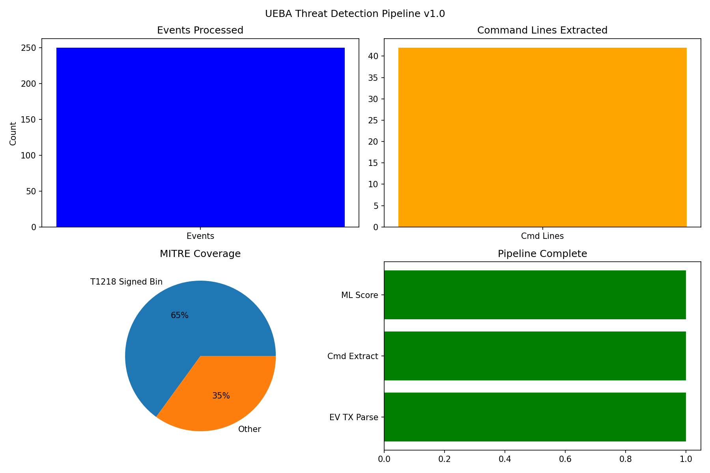
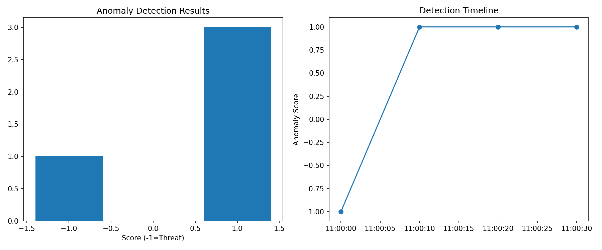

# UEBA Threat Detection Pipeline

Endpoint behavior analytics on Windows EVTX: ML anomaly detection + MITRE T1218 mapping

## Pipeline
1. EVTX parsing → 250+ events
2. Command line extraction → 42 samples  
3. Isolation Forest scoring → threat isolation
4. MITRE ATT&CK T1218 coverage
5. Anomaly timeline visualization

## Demo



## Quickstart
```bash
pip install -r requirements.txt
jupyter notebook 01_threat_research.ipynb
